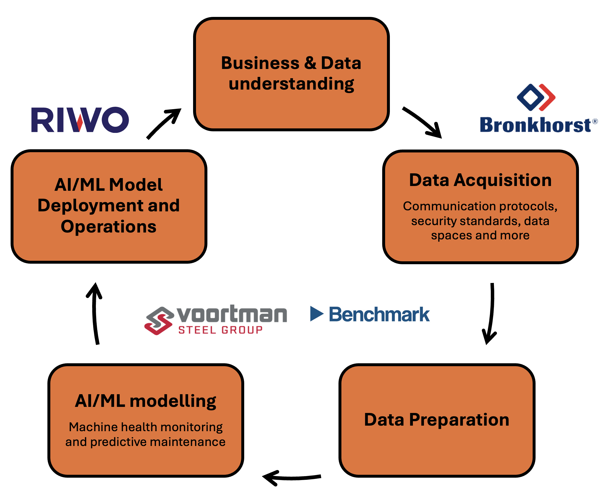

   

# DataFlow

Welcome to the DataFlow project page, which presents an overview of all the latest developments and involved researchers, students and stakeholders. For general project details, checkout the below project pages hosted by
- [TechForFuture](https://techforfuture.nl/project/dataflow-data-must-flow-for-data-driven-digital-manufacturing/)
- [Saxion Ambient Intelligence group](https://www.saxion.nl/onderzoek/overige-projecten/ambient-intelligence/dataflow).

## Our team and research focus

**Stakeholders** *(in alphabetical order)*: Bronkhorst, benchmark, RIWO, Saxion, Voortman

**Reseearchers** *(in alphabetical order)*: Bram Ton, Dennis Borger, Deepak Tunuguntla, Faizan Ahmed, Jeroen Linssen, Peter Ebben, Rahul Ramakrishnan, Sjoerd Zagema

**Students** *(in alphabetical order)*: Khadijeh Shafiee, Linh Toh, Zhaleh Jamalivand, Zibusisu Masuku

### Research focus

|Involved stakeholders|Topic of research|Involved researchers|Students|
|---|---|---|---|
|Bronkhorst|Data Collection|- Bram Ton   - Deepak Tunuguntla|- Zibusisu Masuku|
|Voortman|Data-driven predictive maintenance|- Sjoerd Zagema   - Deepak Tunuguntla   - Dennis Borger|- Student assignment in prep for new academic year|
|Benchmark|Data-driven predictive maintenance|- Deepak Tunuguntla|- Fernando Gonzalez|
|RIWO|MLOps|- Sjoerd Zagema   - Deepak Tunuguntla| - Khadijeh Shafiee   - Zhaleh Jamalivand   - Linh Toh|
|Saxion|Digital Twinning|- Peter Ebben   - Rahul Ramakrishnan   - Dennis Borger   - Deepak Tunuguntla||

## Ongoing developments/dissemination activities

### Articles

### Presentations

### Codebases

### Student projects

|Name|Degree|Project Type|Output|Stakeholder|Status|
|---|---|---|---|---|---|
|Zibusisu Masuku|Saxion Ba Applied Computer Science|Graduation Project|- [Plan of approach](https://saxion.sharepoint.com/:b:/r/teams/o365-team007262/Gedeelde%20documenten/TFF%20DataFlow/Development/WP3_use_cases/Bronkhorst/Students/Zibusisu%20Masuku/Distributed%20MQTT%20Broker%20Project%20Plan.pdf?csf=1&web=1&e=tedzy0)   - [Presentation](https://saxion.sharepoint.com/:p:/r/teams/o365-team007262/Gedeelde%20documenten/TFF%20DataFlow/Development/WP3_use_cases/Bronkhorst/Students/Zibusisu%20Masuku/A%20Fully%20Distributed%20MQTT%20Broker%20Network%20Improved%20Presentation.pptx?d=w781ce198d12240c182e7b7093947dfd7&csf=1&web=1&e=4f878X)   - [Codebase](https://github.com/SaxionAMI/2025-Ecofactorij-DistributedMQTT-Graduation)   - [Technical report](https://www.overleaf.com/2219534252drgctgnrbydy#276f5e)|Bronkhorst|Ongoing|
|Fernando Gonzalez|UTwente Ba Creative Technology|Graduation Project|- [Proposal and plan]()   - [Mid-term report]()   - [Codebase]()|Benchmark|Ongoing|
|- Khadijeh Shafiee   - Zhaleh Jamalivand   - Linh To|Saxion Ma ICT:SE|DataOps Specialisation|- [Technical report](https://saxion.sharepoint.com/:b:/r/teams/o365-team007262/Gedeelde%20documenten/TFF%20DataFlow/Development/student_assignments/Riwo/KhadijehZhalehLinh_DataOpsSpecialisation/technical_report.pdf?csf=1&web=1&e=HlkwZP)   - [Codebase](https://gitlab.com/saxionnl/master-ict-se/dataops/2024-2025/06)|RIWO|Finished|
|Khadijeh Shafiee|Saxion Ma ICT:SE|Graduation Project|- [Proposal](https://saxion.sharepoint.com/:b:/r/teams/o365-team007262/Gedeelde%20documenten/TFF%20DataFlow/Development/student_assignments/Riwo/Khadijeh_GraduationProject/assignment_proposal_khadijeh_shafiee.pdf?csf=1&web=1&e=I0JVSo)|RIWO|Ongoing|
|Linh Toh|Saxion Ma ICT:SE|Graduation Project|- [Proposal](https://saxion.sharepoint.com/:b:/r/teams/o365-team007262/Gedeelde%20documenten/TFF%20DataFlow/Development/student_assignments/Riwo/LinhTo_GraduationProject/assignment_proposal_linh_to.pdf?csf=1&web=1&e=t3G9lp)   - [Plan of Approach](https://saxion.sharepoint.com/:b:/r/teams/o365-team007262/Gedeelde%20documenten/TFF%20DataFlow/Development/student_assignments/Riwo/LinhTo_GraduationProject/plan_of_approach_linh_to.pdf?csf=1&web=1&e=YyYzb2)|Saxion|Ongoing|

Currently, all the links are for private use only. For access, please feel free to reach out to Deepak Tunuguntla (d *dot* r *dot* tunuguntla *AT* saxion *dot* nl). Access can be granted depending on the nature of the document.
